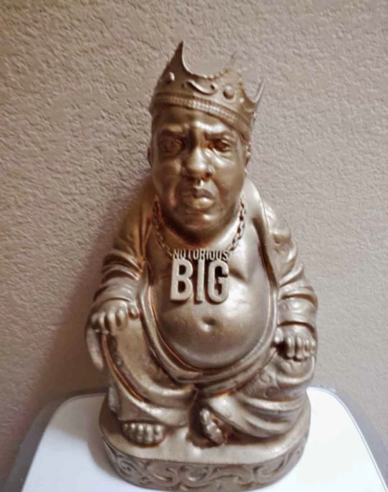

Inspired by this statue from fb marketplace, a comparative exegetical study of the Noble Eightfold Path and The Ten Crack Commandments - see 🧵

1\. Right View ↔ “Never get high on your own supply.”

The Buddha taught that delusion clouds our understanding of reality. Biggie likewise warns against becoming intoxicated by one’s own enterprise. Both traditions begin by insisting that clear perception is essential.

2\. Right Intention ↔ “Never let no one know how much dough you hold.”

Buddhism counsels freedom from greed, pride, and attachment. Biggie recommends discretion and humility regarding worldly wealth. Neither master looked kindly on boastfulness.

3\. Right Speech ↔ “Never trust nobody.”

Granted, the Buddha emphasized honesty and kindness, whereas Biggie’s vision is somewhat darker. Still, both agree that words matter and that careless conversation can lead to suffering.

4\. Right Action ↔ “Never sell no crack where you rest at.”

The Buddha urged his followers to act wisely and avoid bringing harm into their homes and communities. Biggie, in his own idiom, similarly advocates keeping one’s domestic life free from unnecessary chaos.

5\. Right Livelihood ↔ … admittedly, a point of divergence.

The Buddha specifically prohibited trades involving weapons, intoxicants, and harmful substances. Biggie’s career advice does not survive peer review by the monastic community.

6\. Right Effort ↔ “Keep your family and business completely separated.”

Both traditions recognize that discipline requires boundaries. Enlightenment—and apparently entrepreneurship—demands sustained effort and careful organization.

7\. Right Mindfulness ↔ “Never keep no weight on you.”

One should remain aware of one’s circumstances, attachments, and vulnerabilities. Biggie repeatedly emphasizes vigilance and the dangers of complacency.

8\. Right Concentration ↔ “If you ain’t gettin’ bagged, stay the fuck from police.”

Meditative concentration requires focus and an awareness of distractions. Biggie’s practical instructions, though directed toward different ends, likewise stress attention to one’s surroundings.
