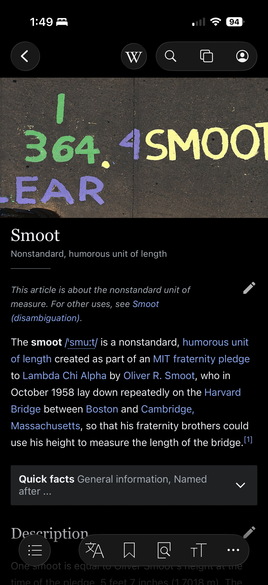
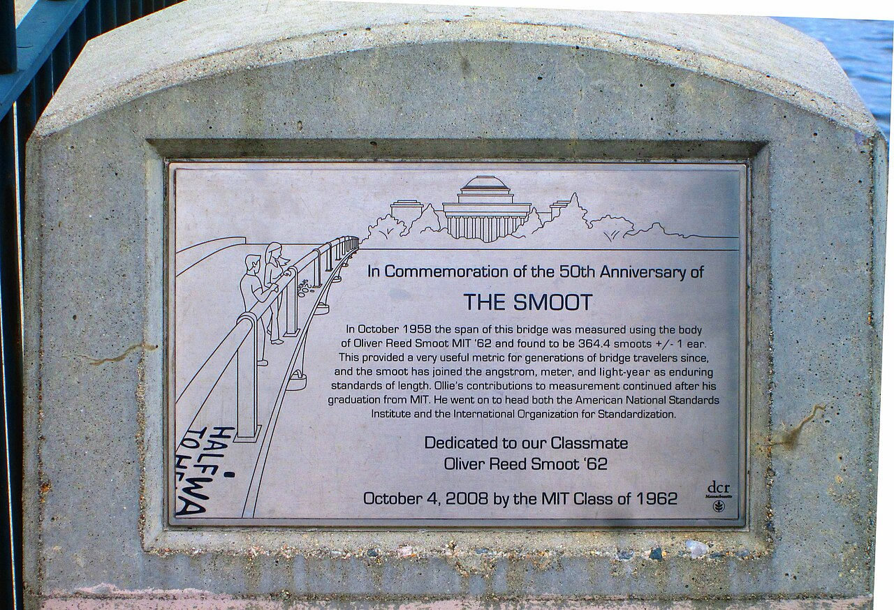

In other nose-related etymological news, “nostril” = “nose +‎ “thirl”. A “thirl” = “hole”, but also a “smoot”.

A “smoot”, in turn, is either a “small opening built into a dry-stone wall to allow sheep to pass through”, or alternatively 5 feet 7 inches, the exact height of this guy Oliver Smoot.

> **[Smoot - Wikipedia](https://en.wikipedia.org/wiki/Smoot?wprov=sfti1#Description)**

He’s even got a plaque! And he went on to head both the American National Standards Institute and the International Organization for Standardization!

Oh wow, Wikipedia’s List of Non-Coherent Units of Measurement is a goldmine.

> **[List of non-coherent units of measurement - Wikipedia](https://en.wikipedia.org/wiki/List_of_non-coherent_units_of_measurement?wprov=sfti1)**

The “garn”:\
NASA's unit of measure for symptoms resulting from space adaptation syndrome, the response of the human body to weightlessness in space, named after US Senator Jake Garn, who became exceptionally spacesick during an orbital flight in 1985”

The “crab”:\
the intensity of X-rays emitted from the Crab Nebula at a given photon energy up to 30 kiloelectronvolts

> **[Crab (unit) - Wikipedia](https://en.wikipedia.org/wiki/Crab_(unit)?wprov=sfti1#)**

The “micromort”:\
a one-in-a-million chance of death. Smoking 1.4 cigarettes or driving 230 miles costs roughly one micromort.

> **[Micromort - Wikipedia](https://en.wikipedia.org/wiki/Micromort?wprov=sfti1#)**

“Banana equivalent dose”\
The amount of radiation absorbed from eating one banana

> **[Banana equivalent dose - Wikipedia](https://en.wikipedia.org/wiki/Banana_equivalent_dose?wprov=sfti1)**

Oh snap move over “List of Non-Coherent Units of Measurement”, hello “List of humorous units of measurement”

> **[List of humorous units of measurement - Wikipedia](https://en.wikipedia.org/wiki/List_of_humorous_units_of_measurement?wprov=sfti1#)**

“Ohnosecond”\
the second after one makes a terrible mistake, such as deleting the wrong file or sending a text message to the wrong person, where the person in question can do nothing but say "oh no”

“Sheppey”\
the closest distance at which sheep remain picturesque (created by Douglas Adams!

“Bruno”\
the volume of the dent left in asphalt pavement after a piano is dropped six stories from the roof of MIT's Baker House. Named for the student who noticed that the rules prohibited throwing objects from windows but not dropping them from the roof.

“Millihelen”\
the amount of beauty required to launch one ship. Because Helen had the “face that launched a thousand ships”. A negative helen is sufficient ugliness to beach ships. Very timely with The Odyssey out now.

“Bee’s dick”

An Australian term for a very small distance, as in "he missed crashing into the truck by a bee's dick". It is derived from the small size of a male bee's penis. The entry then links to the page for the actual organ

> **[Drone (bee) - Wikipedia](https://en.wikipedia.org/wiki/Drone_(bee)?wprov=sfti1#Mating_and_the_drone_reproductive_organ)**

“Standardized giraffe unit”

The standardized giraffe unit (SGU) is proposed by the European Space Agency's Near-Earth Object Coordination Centre as a standardized unit for animal size reference. A corgi is 0.05 giraffes, while an elephant is 1.25 giraffes.
