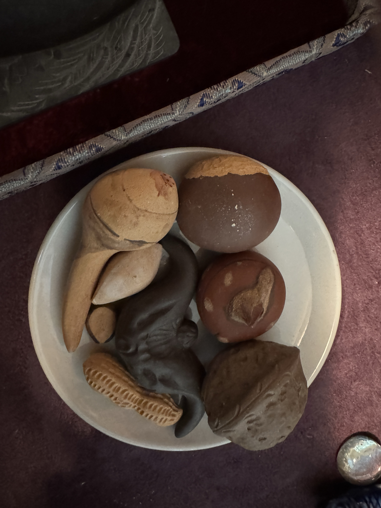

Apparently, in 17th century China, potters got really good at making hyperrealistic nuts out of clay.

The style was revived in the 20th century because we had not yet reached Peak Hyperrealistic Clay Nut.

Honestly? Fair.

