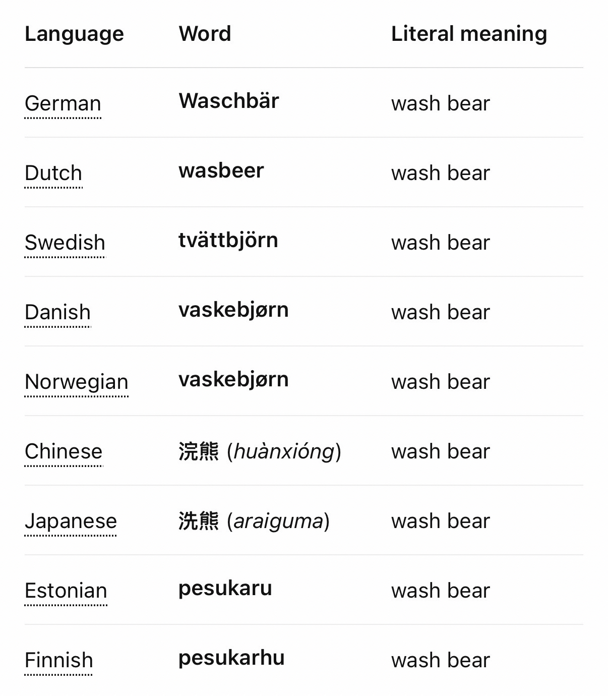
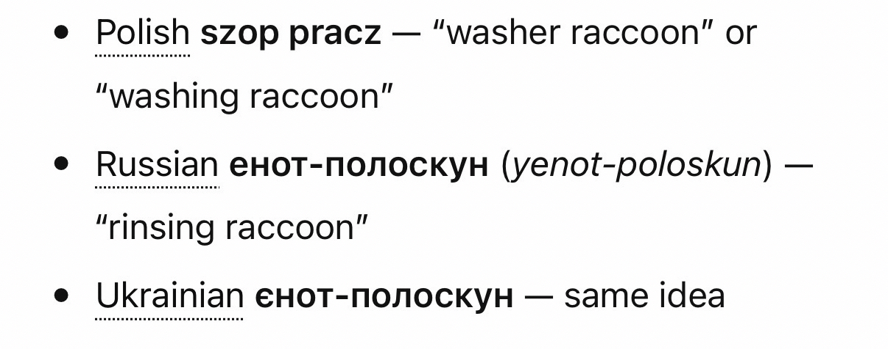

TIL: The raccoon, to a surprising number of quite disparate world languages, is the “wash bear”, derived from its habit of appearing to wash its food.

Related: [The real names of animals!](https://www.reddit.com/r/ProperAnimalNames/)
